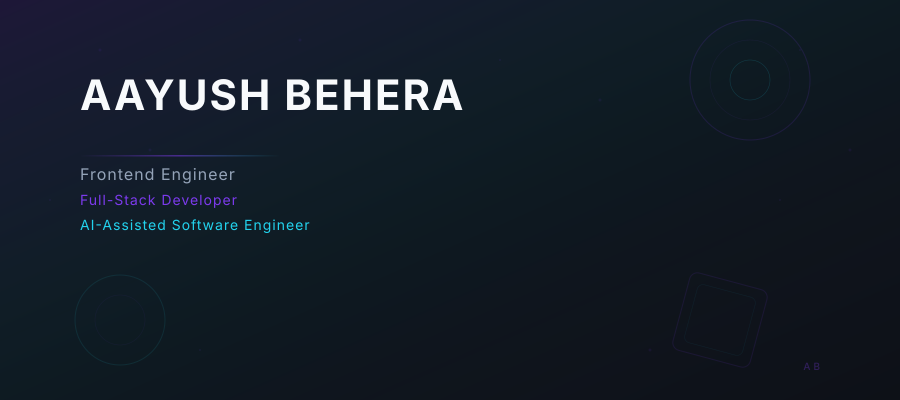

  <picture>
    <source media="(prefers-color-scheme: dark)" srcset="assets/hero.svg">
    
  </picture>

 

  

 

## Experience

**Chart Sentinel** — Contract Web Developer
Built premium trading intelligence dashboards and real-time analytics interfaces.

**Sandbox Scholars** — Frontend Developer (Contract)
Developed responsive frontend experiences and component libraries for educational platforms.

**Ageix Partners** — Web Analytics Developer (Contract)
Integrated analytics pipelines and data visualization layers for business intelligence.

**The Failure Story** — Content Writer
Crafted technical narratives and developer-focused content for a growing audience.

---

## Featured Projects

**ArrowEra Trade** — AI trading platform with real-time market analysis and portfolio management. `Python` `FastAPI` `React` `PostgreSQL` `Redis`

**ArrowEra Code AI** — AI-assisted coding environment with intelligent code generation and real-time assistance. `Python` `FastAPI` `WebSockets` `OpenAI`

**ArrowERA CMS** — AI-automated content management system with intelligent workflows and role-based access. `TypeScript` `React` `Node.js` `PostgreSQL` `Docker`

**ArrowERA Mindframe** — Cognitive analysis platform using NLP to detect emotional patterns and cognitive distortions. `Python` `NLP` `FastAPI` `SQL` `Machine Learning`

---

## Tech Stack

`React` `Next.js` `TypeScript` `Tailwind` `Three.js` `FastAPI` `Node.js` `PostgreSQL` `Redis` `OpenAI` `Ollama` `RAG` `AI Agents` `Docker` `GitHub Actions` `Git` `Linux`

---

## GitHub Activity

  
  

  

---

  <a href="https://github.com/AayushBehera">GitHub</a> · <a href="https://in.linkedin.com/in/aayush-behera-203928371">LinkedIn</a> · Portfolio
    
  Design & build by Aayush Behera

 
